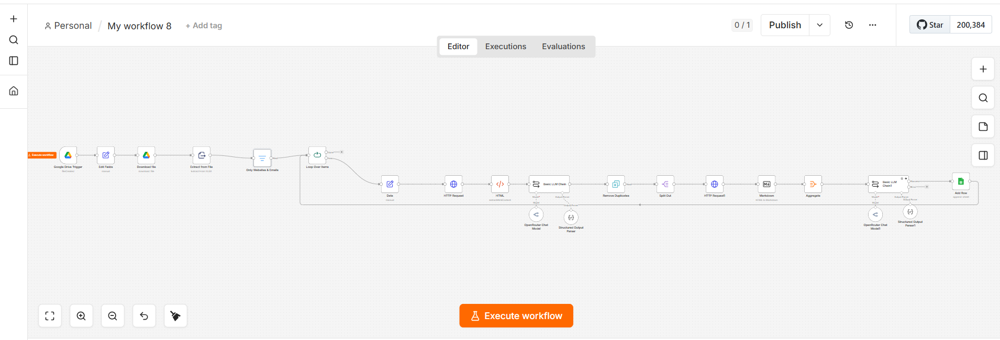

# AI Lead Generation & Qualification Automation

AI-powered lead generation and qualification workflow built with n8n.

## Overview

This project automates the process of discovering potential business leads, extracting relevant website information, and preparing qualified lead data for further sales outreach.

The workflow combines web scraping, HTTP requests, data processing, and AI-powered analysis to turn raw website data into structured lead information.

## What It Does

- Collects potential business leads
- Extracts and processes website data
- Removes duplicate results
- Converts website HTML into Markdown
- Uses AI to analyze and qualify leads
- Extracts structured lead information
- Prepares lead data for CRM usage
- Designed for scalable sales automation

## Workflow

```text
Lead Source
    ↓
Data Extraction
    ↓
Website Filtering
    ↓
HTTP Requests
    ↓
HTML Processing
    ↓
AI Analysis
    ↓
Lead Qualification
    ↓
Structured Lead Data
    ↓
CRM / Google Sheets
## Workflow


